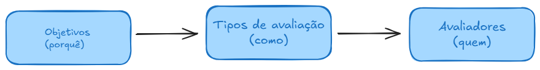

# Prompt Evaluation

- Avaliação de Modelos, NLP -> Avaliação de Prompts
- Como as instruções dadas ao LLM influenciam a qualidade das respostas
- Pequenas mudanças no prompt podem melhorar ou degradar a performance nas execuções

## O que devemos avaliar

- Ao Avaliar qualquer tipo de prompt



- Comparar prompts versionados


## Entendendo Objetivos

- **correctness:** se a saída está correta de acordo com uma referência ou fato.

- **relevance:** se a saída realmente responde à pergunta feita.

- **faithfulness/ groundedness:** se a saída se mantém fiel ao contexto e não alucina informações.

- **conciseness:** se a saída é objetiva, sem enrolação desnecessária.

- **helpfulness:** se a saída é útil e clara para o usuário

- **harmfulness/bias/toxicity:** se a saída não contém conteúdo tóxico, enviesado ou prejudicial.

- **format adherence (às vezes chamado de _output format_):** se a saída segue o formato esperado. Exemplo: JSON válido, regex, schema.

- **efficiency:** métricas de execução, latência, custo de tokens, throughput.

- **comparative evaluation/pairwise preference:** comparação entre duas ou mais versões de prompts.

## Métricas e Tipos de Avaliação

### Objetivas (determinísticas)

- Precision, Recall, F1, Accuracy: usados em classificação, extração de campos e detecção de entidades.
- Exact Match: classificação "fechada" - certo ou errado
- String Distance/Edit Distance: quão próximo o texto gerado está de uma referência
- embedding similarity: medir proximidade semântica entre saída e referência (cosseno, L2)
- JSON validity, schema validation: usado para outputs estruturados.

### Subjetivas (LLM-as-judge ou humanos)

- correctness: se a resposta está correta de acordo com uma referência
- relevance: se a saída responde à pergunta de fato
- faithfulness/groundedness: não alucina além do contexto dado
- conciseness: objetivo ou prolixo
- helpfulness, harmfulness, bias, toxicity: segurança e qualidade subjetiva

> [!WARNING] > **Observação**:
> Nomes similares em diferentes plataformas ou artigos
>
> - Critéria evaluators
> - Custom rubric
> - LLM Judge
> - Rating criteria

### Sistêmcias (foca na execução, não no conteúdo)

- Latência: tempo de resposta do modelo
- Custo: tokens usados x preço
- Throughput: qunatas requisições por segundo o sistema aguenta
- Pass Rate %: de exemplos eque passaram em um critério

### Comparativas

- Pairwise Evaluation/ model comparison: comparar duas saídas A vs B
- A/B Testing: medir taxas de aceitação de usuários em produção

### Ground Truth

- Referência de "verdade"
- Respostas corretas/conhecidas usadas como base para comparar a saída.

## Avaliadores/Evaluators

### Code Evaluator

- Executa código determinístico para avaliar uma saída
- Criação de uma função que recebe input, output, reference (opcional) e retorna métricas (número, boolean, string)

Exemplo:

```text
Pergunta: Qual o banco de dados mais utilizado no mundo?
Referência: PostgreSQL
Saída: PostgreSQL

Avaliação: exact_match

Resultado: { "key": "exact_match", "score": 1 }
```

### LLM-as-Judge

- Usa LLM para julgar as saídas com base em uma "rubrica"
- Definimos critérios (relevance, correctness, etc)

Exemplo

```text
Pergunta: Como usar goroutines em Go?
Saída: fala sobre threads em Java

Avaliação: relevance

Resultado: { "key": "relevance", "score": 0.2, "coment": "A resposta não é relevante, pois fala sobre Java em vez de Go." }
```

### Pairwise Evaluator

- Compara duas respostas para o mesmo input
- Configuração de critérios e o avaliador escolhe a melhor saída

Exemplo

```text
Pergunta: Como trabalhar com timeout em uma HTTP Request em GO?
Resposta A: context.withtimeout
Resposta B: time.sleep

Avaliação: correctness

Resultado: { "key": "pairwise_preference", "value": "A" }
```

### Summary Evaluator

- Calcula métricas agregadas
- Consolida "scores" de muitos exemplos em métricas finais (Ex.: pass rate, F1)

Exemplo

```text
Dataset com 10 exemplos de QA
87 respostas foram corretas

Avaliação: pass rate

Resultado: [
  { "key": "precision", "score": 0.80 }
  { "key": "recall", "score": 0.84 }
  { "key": "f1", "score": 0.82 }
]
```

### Composite Evaluator

- Combina múltiplas métricas diferentes em um score único ponderado
- Define de pesos para métricas já existentes e gera uma métrica final

Exemplo

```text
correctness = 0.9, relavance = 0.7, conciseness = 0.8

Formula: 0.5 * correctness + 0.3 * relevance + 0.2 * conciseness

Resultado: { "key": "quality_weighted", "score": 0.82 }
```
