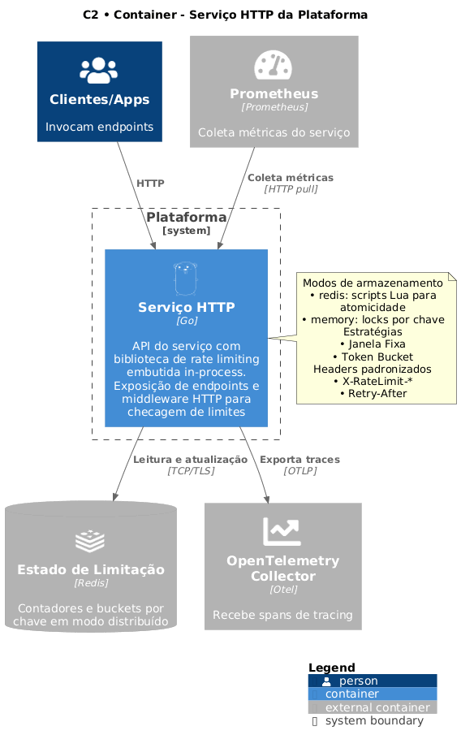

# Diagramas de Design e Arquitetura

## Diagramas C4

É um modelo para representar a arquitetura em diferentes níveis de detalhe. Ele organiza a visualização de como o sistema se relaciona com usuários e sistemas externos, quais containers o compõem, como cada parte interna é estruturada e, se necessário, como o código está organizado. Essa estrutura também facilita para agentes de IA entenderem o contexto do sistema, permitindo análise, refatoração e geração de artefatos técnicos com mais precisão.

> [!NOTE]
> Referência: **[https://c4model.com/](https://c4model.com/)**

### C1: System Context Diagram (visão externa)

- Define o sistema no ambiente em que ele opera
- Identifica usuários, consumidores e integrações externas
- Bom para alinhamento entre diferentes times como: desenvolvimento, produto, segurança, etc.

> [!NOTE]
> Referência: **[https://c4model.com/diagrams/system-context](https://c4model.com/diagrams/system-context)**

### C2: Container Diagram (visão de containers)

- Agrupa os principais blocos: serviços, aplicações, bancos, filas, APIs
- Evidencia como esses blocos se comunicam e em quais protocolos
- Ajuda em decisões de infraestrutura, escalabilidade e deploy

> [!NOTE]
> Referência: **[https://c4model.com/diagrams/container](https://c4model.com/diagrams/container)**

### C3: Component Diagram (visão de componentes)

- Organiza cada container em módulos, pacotes ou camadas
- Deixa claro onde estão as responsabilidades
- Auxilia desenvolvedores a manterem coesão e baixo acoplamento

> [!NOTE]
> Referência: **[https://c4model.com/diagrams/component](https://c4model.com/diagrams/component)**

### C4: Code Diagram (visão de código)

- Aprofunda em classes, funções ou estruturas
- Usado apenas quando há necessidade real de padronização ou auditoria.
- Não é obrigatório na maioria dos projetos
- Raramente recomendado

> [!NOTE]
> Referência: **[https://c4model.com/diagrams/code](https://c4model.com/diagrams/code)**
