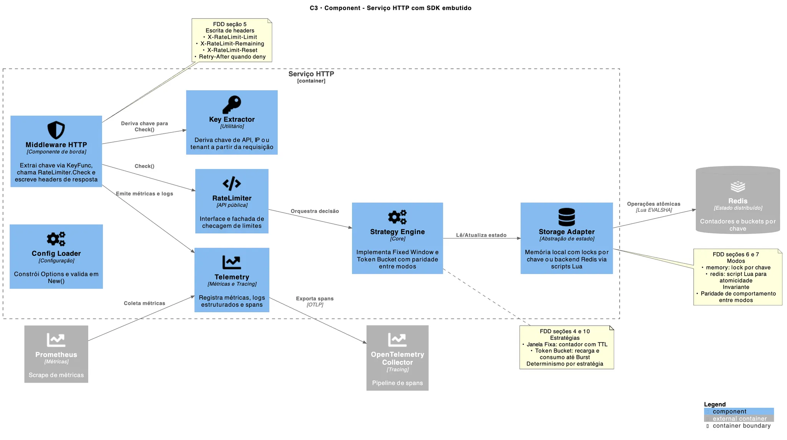
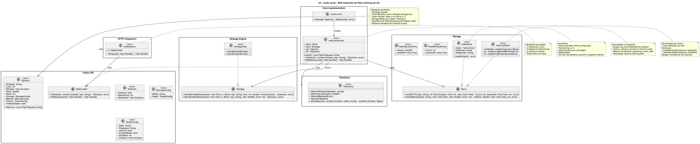

# Diagramas C4 - Rate Limiter

## C1 - System Context


```plantuml
@startuml
!define C4P https://raw.githubusercontent.com/plantuml-stdlib/C4-PlantUML/master
!includeurl C4P/C4_Context.puml

!define DEVICONS https://raw.githubusercontent.com/tupadr3/plantuml-icon-font-sprites/v2.4.0
!define FONTAWESOME https://raw.githubusercontent.com/tupadr3/plantuml-icon-font-sprites/v2.4.0
!includeurl FONTAWESOME/font-awesome-5/user_circle.puml
!includeurl FONTAWESOME/font-awesome-5/user_tie.puml
!includeurl FONTAWESOME/font-awesome-5/chart_line.puml

LAYOUT_LEFT_RIGHT()
title C1 • System Context - Plataforma de Microsserviços

Person(user, "Usuário Final", "Interage com endpoints HTTP", $sprite="user_circle")
Person(dev, "Desenvolvedor da Plataforma", "Mantém e integra serviços", $sprite="user_tie")

System_Boundary(platform, "Plataforma de Microsserviços") {
  System(services, "Microsserviços da Plataforma", "Serviços com biblioteca de rate limiting embutida para decidir allow/deny e padronizar observabilidade")
}

System_Ext(state, "Armazenamento de Estado Compartilhado", "Backend opcional para estado de limitação")
System_Ext(obs, "Sistemas de Observabilidade", "Coleta de métricas e tracing", $sprite="chart_line")

Rel(user, services, "Requisições HTTP")
Rel(dev, services, "Desenvolve e integra")
Rel(services, state, "Lê e mantém contadores por chave")
Rel(services, obs, "Exporta métricas e traces")

note right of services
  Propósito
  • Garantir limites por chave, IP e plano
  • Decisões locais com estado compartilhado opcional
  • Observabilidade padronizada entre serviços
end note

SHOW_LEGEND()
@enduml
```

​

## C2 - Container


```plantuml
@startuml
!define C4P https://raw.githubusercontent.com/plantuml-stdlib/C4-PlantUML/master
!includeurl C4P/C4_Container.puml

!define DEVICONS https://raw.githubusercontent.com/tupadr3/plantuml-icon-font-sprites/v2.4.0
!define FONTAWESOME https://raw.githubusercontent.com/tupadr3/plantuml-icon-font-sprites/v2.4.0
!includeurl DEVICONS/devicons/go.puml
!includeurl DEVICONS/devicons/redis.puml
!includeurl FONTAWESOME/font-awesome-5/chart_line.puml
!includeurl FONTAWESOME/font-awesome-5/tachometer_alt.puml
!includeurl FONTAWESOME/font-awesome-5/users.puml

LAYOUT_TOP_DOWN()
title C2 • Container - Serviço HTTP da Plataforma

Person(users, "Clientes/Apps", "Invocam endpoints", $sprite="users")

System_Boundary(sys, "Plataforma") {
  Container(api, "Serviço HTTP", "Go", "API do serviço com biblioteca de rate limiting embutida in-process. Exposição de endpoints e middleware HTTP para checagem de limites", $sprite="go")
}

ContainerDb_Ext(redis, "Estado de Limitação", "Redis", "Contadores e buckets por chave em modo distribuído", $sprite="redis")
Container_Ext(otel, "OpenTelemetry Collector", "Otel", "Recebe spans de tracing", $sprite="chart_line")
Container_Ext(prom, "Prometheus", "Prometheus", "Coleta métricas do serviço", $sprite="tachometer_alt")

Rel(users, api, "HTTP")
Rel(api, redis, "Leitura e atualização", "TCP/TLS")
Rel(api, otel, "Exporta traces", "OTLP")
Rel(prom, api, "Coleta métricas", "HTTP pull")

note right of api
  Modos de armazenamento
  • redis: scripts Lua para atomicidade
  • memory: locks por chave
  Estratégias
  • Janela Fixa
  • Token Bucket
  Headers padronizados
  • X-RateLimit-*
  • Retry-After
end note

SHOW_LEGEND()
@enduml
```

## C3 - Component



```plantuml
@startuml
!define C4P https://raw.githubusercontent.com/plantuml-stdlib/C4-PlantUML/master
!includeurl C4P/C4_Component.puml

!define DEVICONS https://raw.githubusercontent.com/tupadr3/plantuml-icon-font-sprites/v2.4.0
!define FONTAWESOME https://raw.githubusercontent.com/tupadr3/plantuml-icon-font-sprites/v2.4.0
!includeurl DEVICONS/devicons/go.puml
!includeurl DEVICONS/devicons/redis.puml
!includeurl FONTAWESOME/font-awesome-5/cogs.puml
!includeurl FONTAWESOME/font-awesome-5/database.puml
!includeurl FONTAWESOME/font-awesome-5/shield_alt.puml
!includeurl FONTAWESOME/font-awesome-5/code.puml
!includeurl FONTAWESOME/font-awesome-5/chart_line.puml
!includeurl FONTAWESOME/font-awesome-5/key.puml

LAYOUT_LEFT_RIGHT()
title C3 • Component - Serviço HTTP com SDK embutido

Container_Boundary(api, "Serviço HTTP", "Go") {
  Component(mw, "Middleware HTTP", "Componente de borda", "Extrai chave via KeyFunc, chama RateLimiter.Check e escreve headers de resposta", $sprite="shield_alt")
  Component(rl, "RateLimiter", "API pública", "Interface e fachada de checagem de limites", $sprite="code")
  Component(cfg, "Config Loader", "Configuração", "Constrói Options e valida em New()", $sprite="cogs")
  Component(strategy, "Strategy Engine", "Core", "Implementa Fixed Window e Token Bucket com paridade entre modos", $sprite="cogs")
  Component(store, "Storage Adapter", "Abstração de estado", "Memória local com locks por chave ou backend Redis via scripts Lua", $sprite="database")
  Component(tel, "Telemetry", "Métricas e Tracing", "Registra métricas, logs estruturados e spans", $sprite="chart_line")
  Component(kx, "Key Extractor", "Utilitário", "Deriva chave de API, IP ou tenant a partir da requisição", $sprite="key")
}

ContainerDb_Ext(redis, "Redis", "Estado distribuído", "Contadores e buckets por chave", $sprite="redis")
Container_Ext(otel, "OpenTelemetry Collector", "Tracing", "Pipeline de spans", $sprite="chart_line")
Container_Ext(prom, "Prometheus", "Métricas", "Scrape de métricas", $sprite="chart_line")

Rel(mw, rl, "Check()")
Rel(rl, strategy, "Orquestra decisão")
Rel(strategy, store, "Lê/Atualiza estado")
Rel(mw, tel, "Emite métricas e logs")
Rel(tel, otel, "Exporta spans", "OTLP")
Rel(prom, tel, "Coleta métricas")
Rel(store, redis, "Operações atômicas", "Lua EVALSHA")
Rel(mw, kx, "Deriva chave para Check()")

note right of store
  FDD seções 6 e 7
  Modos
  • memory: lock por chave
  • redis: script Lua para atomicidade
  Invariante
  • Paridade de comportamento entre modos
end note

note right of strategy
  FDD seções 4 e 10
  Estratégias
  • Janela Fixa: contador com TTL
  • Token Bucket: recarga e consumo até Burst
  Determinismo por estratégia
end note

note right of mw
  FDD seção 5
  Escrita de headers
  • X-RateLimit-Limit
  • X-RateLimit-Remaining
  • X-RateLimit-Reset
  • Retry-After quando deny
end note

SHOW_LEGEND()
@enduml
```

## C4 - Code (Exemplo de função Check)

```plantuml
@startuml
' C4 nível de código usando classes e interfaces
skinparam packageStyle rectangle
title C4 • Code Level - SDK embutido de Rate Limiting em Go

package "Public API" {
  interface RateLimiter {
    + Check(ctx: context.Context, key: string) : (Decision, error)
    + Middleware(next: http.Handler) : http.Handler
  }

  class Decision <<struct>> {
    + Allowed: bool
    + Remaining: int
    + RetryAfter: time.Duration
  }

  class Options <<struct>> {
    + Strategy: string
    + Limit: int
    + Window: time.Duration
    + Rate: float64
    + Burst: int
    + KeyFunc: func(*http.Request) string
    + Storage: StorageConfig
    + Metrics: MetricsConfig
    + Tracer: TracerConfig
    + FallbackOpen: bool
  }

  class StorageConfig <<struct>> {
    + Mode: string
    + Redis: *RedisConfig
  }

  class RedisConfig <<struct>> {
    + Addr: string
    + Password: string
    + UseTLS: bool
    + ClusterMode: bool
    + PoolSize: int
    + Timeout: time.Duration
  }
}

package "Core Implementation" {
  ' Fachada concreta
  class rateLimiterImpl <<struct>> {
    - store: Store
    - strat: Strategy
    - opt: Options
    - tel: Telemetry
    - keyFn: func(*http.Request) string
    + Check(ctx: context.Context, key: string) : (Decision, error)
    + Middleware(next: http.Handler) : http.Handler
  }

  class constructor {
    + New(opt: Options) : (RateLimiter, error)
  }
}

package "Strategy Engine" {
  ' Inferência documentada: Strategy interface
  interface Strategy {
    + DecideFixedWindow(now: time.Time, s: Store, key: string, limit: int, window: time.Duration) : (Decision, error)
    + DecideTokenBucket(now: time.Time, s: Store, key: string, rate: float64, burst: int) : (Decision, error)
  }

  class strategyImpl <<struct>> {
    + DecideFixedWindow(...)
    + DecideTokenBucket(...)
  }
}

package "Storage" {
  ' Inferência documentada: Store interface
  interface Store {
    + IncWithTTL(key: string, ttl: time.Duration, limit: int, now: time.Time) : (count: int, expiresAt: time.Time, err: error)
    + GetSetBucket(key: string, now: time.Time, rate: float64, burst: int) : (tokens: float64, next: time.Time, err: error)
  }

  ' Modo memória
  class memoryStore <<struct>> {
    - muByKey: map[string]*sync.Mutex
    - fw: map[string]FixedWindowEntry
    - tb: map[string]TokenBucketEntry
  }

  class FixedWindowEntry <<struct>> {
    + count: int
    + expiresAt: time.Time
  }

  class TokenBucketEntry <<struct>> {
    + tokens: float64
    + lastRefill: time.Time
  }

  ' Modo Redis
  class redisStore <<struct>> {
    - client: *redis.Client
    - shaFixed: string
    - shaBucket: string
    + loadScripts() : error
  }
}

package "HTTP Integration" {
  class middleware <<struct>> {
    - rl: RateLimiter
    + Wrap(next: http.Handler) : http.Handler
  }
}

package "Telemetry" {
  class Telemetry <<struct>> {
    + RecordDecision(decision: string)
    + ObserveLatency(ms: float64)
    + RecordBackendError()
    + RecordFallback()
    + StartSpan(ctx: context.Context, name: string) : (context.Context, Span)
  }
}

' Relacionamentos
rateLimiterImpl ..|> RateLimiter
constructor --> rateLimiterImpl : creates
constructor --> Options : uses
rateLimiterImpl --> Strategy : uses
rateLimiterImpl --> Store : uses
rateLimiterImpl --> Telemetry : emits
middleware --> RateLimiter : calls
memoryStore ..|> Store
redisStore ..|> Store
strategyImpl ..|> Strategy

' Notas de validação e invariantes
note right of constructor
  Validações em New()
  • Strategy exigida
  • Fixed Window: Limit e Window obrigatórios
  • Token Bucket: Rate > 0 e Burst >= 1
  • Storage.Mode em {"redis","memory"}
  • Coerência de RedisConfig quando Mode="redis"
  • Defaults sensatos de timeouts e pool
end note

note right of memoryStore
  Atomicidade por chave
  • Lock dedicado por key
  Estruturas
  • FixedWindowEntry{count, expiresAt}
  • TokenBucketEntry{tokens, lastRefill}
  Relógio monotônico em cálculos
end note

note right of redisStore
  Atomicidade no backend
  • Scripts Lua com EVALSHA no primário
  • Leitura, cálculo e escrita no mesmo script
  • Retorno de allowed, remaining e retry_after
  • Recarregar script se SHA ausente
end note

note right of rateLimiterImpl
  Invariantes
  • Nunca exceder limite configurado
  • Remaining >= 0
  • Determinismo por estratégia
  FallbackOpen
  • Em erro de backend, permitir e registrar métrica
end note

note right of middleware
  Semântica de headers
  • X-RateLimit-Limit
  • X-RateLimit-Remaining
  • X-RateLimit-Reset
  • Retry-After em deny
end note
@enduml
```




