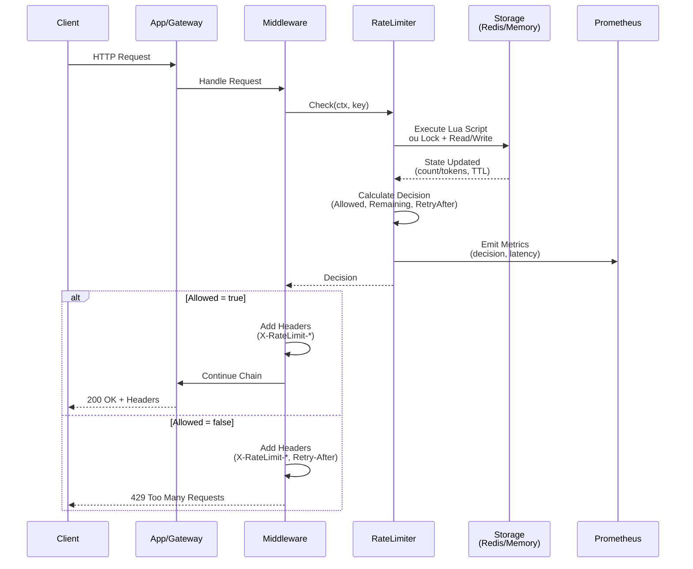
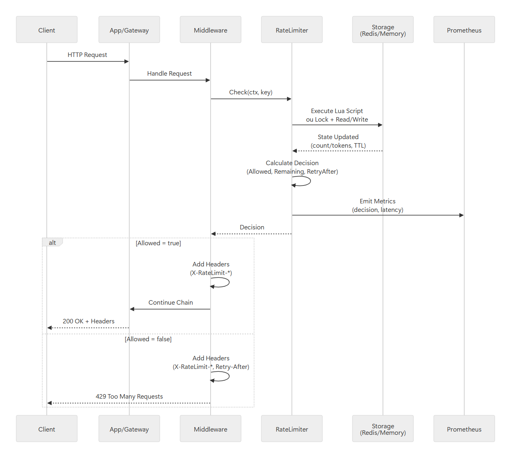
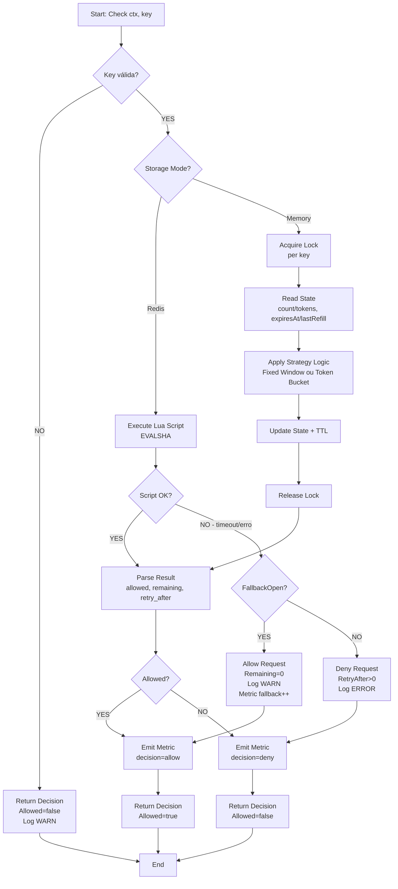
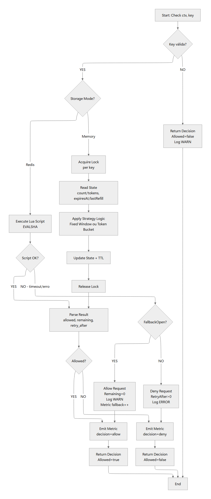
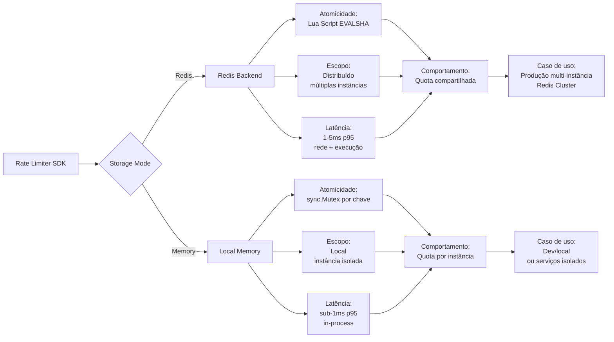
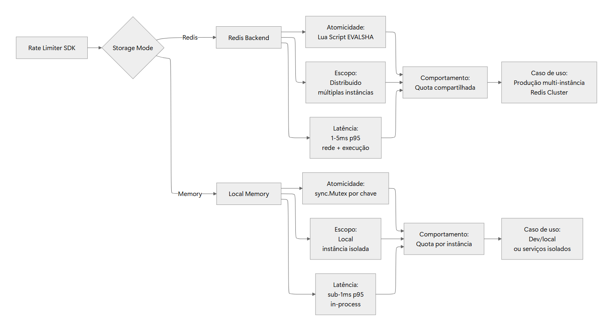
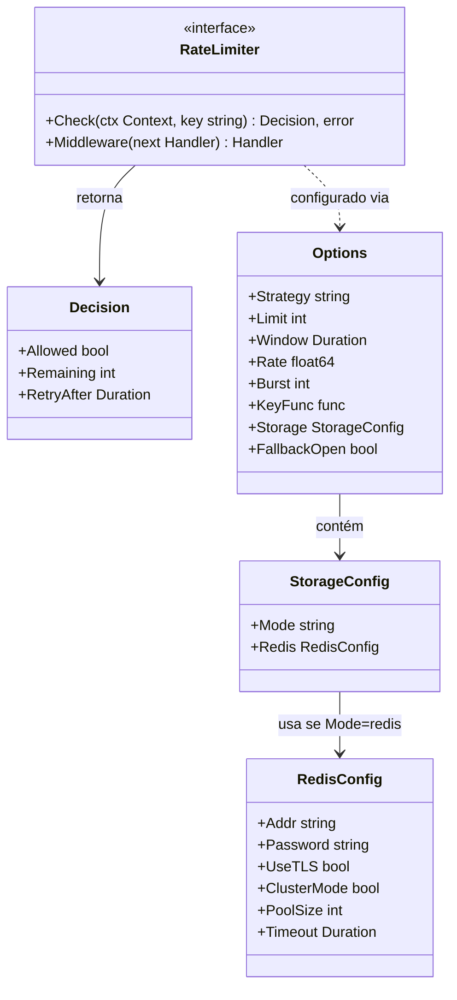
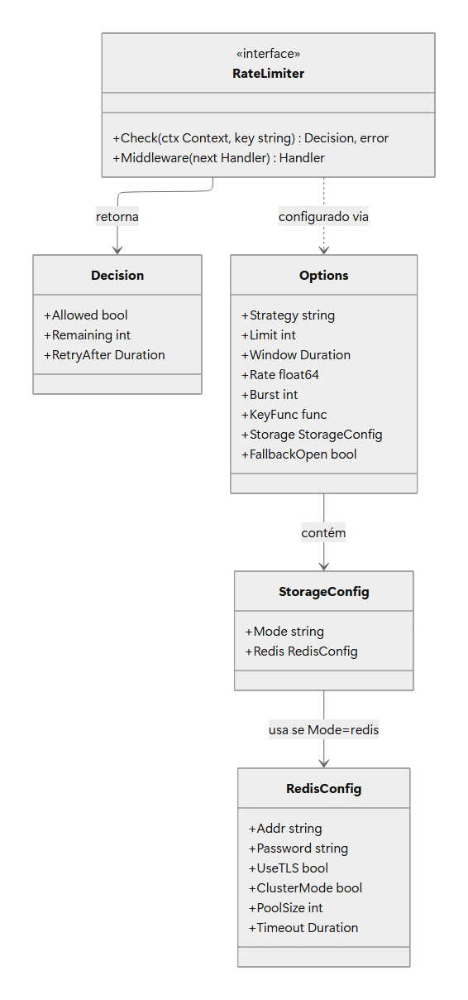
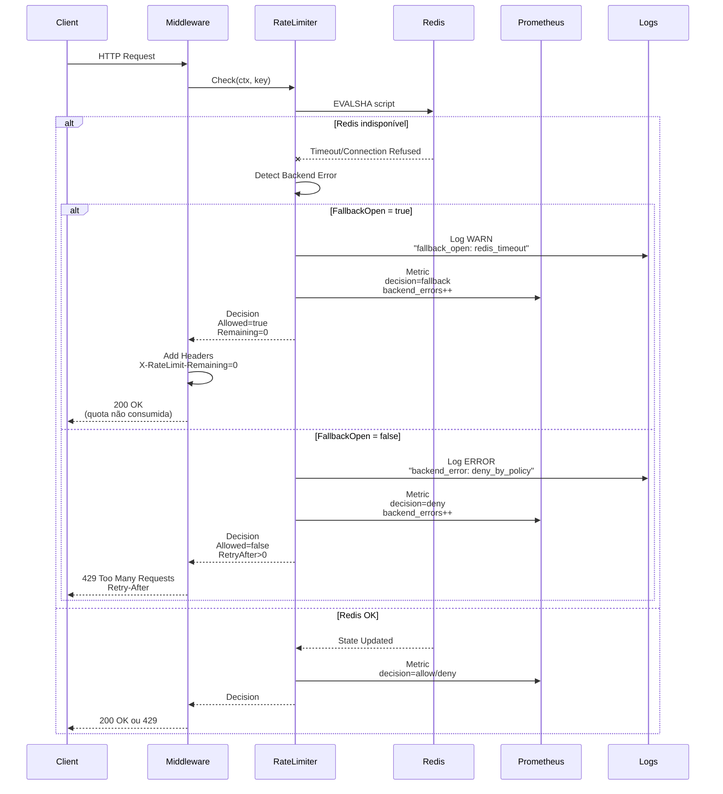
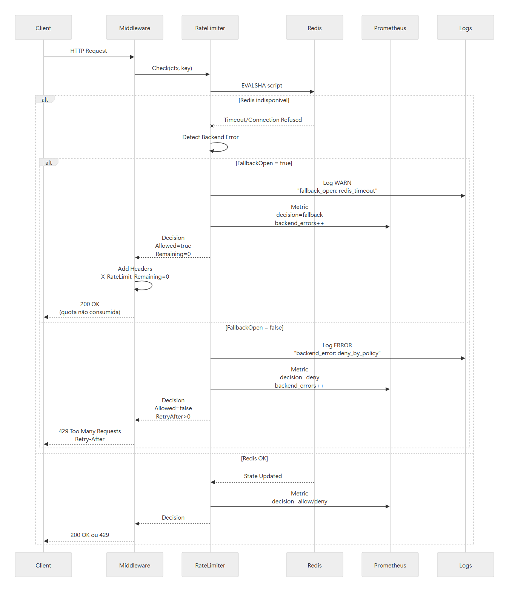

# Diagramas Mermaid - Rate Limiter

# Visão Geral

O Rate Limiter é um SDK embarcado em microsserviços Go que centraliza a lógica de limitação de requisições dentro do próprio processo da aplicação. Ele decide localmente se uma requisição deve ser permitida ou negada, baseando-se em estratégias configuráveis (Janela Fixa ou Token Bucket) e persistindo o estado em Redis (modo distribuído) ou memória local (modo isolado). O SDK oferece uma API pública estável, integração via middleware HTTP, telemetria nativa e modo permissivo (FallbackOpen) para garantir disponibilidade em caso de falhas no backend de armazenamento.

## Elementos Identificados

### Fluxos externos

- Cliente HTTP enviando requisições para serviços
- Gateway/Aplicação recebendo requisições e aplicando middleware
- Redis Cluster como backend de armazenamento distribuído
- Prometheus para coleta de métricas
- OpenTelemetry Collector para exportação de traces

### Processos internos

- Método `Check(ctx, key)` que retorna Decision (Allowed, Remaining, RetryAfter)
- Middleware HTTP que intercepta requisições e aplica rate limiting
- Algoritmo de Janela Fixa: contador por chave com TTL
- Algoritmo de Token Bucket: recarga contínua de tokens até um teto (Burst), consumo por requisição
- Execução atômica via scripts Lua no Redis
- Sincronização por chave (sync.Mutex) no modo memória
- Geração de headers HTTP: X-RateLimit-Limit, X-RateLimit-Remaining, X-RateLimit-Reset, Retry-After
- Logging estruturado JSON com hash de chaves (proteção PII)
- Emissão de métricas de decisões (allow/deny/fallback), latência, erros de backend

### Variações de comportamento

- Storage Mode: Redis (distribuído) vs Memory (local)
- Estratégias: Fixed Window vs Token Bucket
- FallbackOpen: true (permite requisições em caso de erro) vs false (nega requisições em caso de erro)
- Redis standalone vs Redis Cluster
- TLS/mTLS habilitado ou desabilitado

### Contratos públicos

- Interface `RateLimiter` com métodos `Check` e `Middleware`
- Struct `Decision` com campos Allowed, Remaining, RetryAfter
- Struct `Options` com configurações de Strategy, Limit, Window, Rate, Burst, Storage, FallbackOpen
- Headers HTTP padronizados conforme especificação
- Formato de log estruturado JSON
- Métricas Prometheus com labels decision, strategy, storage_mode

## Diagramas

### Fluxo Principal de Decisão

Este diagrama mostra a interação completa entre um cliente HTTP, a aplicação (com middleware do SDK), o Rate Limiter e o backend de armazenamento (Redis ou memória). Ele ilustra o caminho feliz onde uma requisição é verificada, a decisão é tomada com base no estado armazenado, headers HTTP são adicionados e a resposta é retornada. Este diagrama é essencial para entender o fluxo end-to-end do sistema e como os componentes se comunicam durante uma verificação de rate limit.

**Notas**:

- A chave (key) é extraída da requisição via KeyFunc configurada (ex: IP, API Key, tenant)
- No modo Redis, a atomicidade é garantida por scripts Lua (EVALSHA)
- No modo memória, a atomicidade é garantida por sync.Mutex por chave
- As métricas são emitidas de forma assíncrona para não bloquear o fluxo crítico
- Headers são adicionados independentemente da decisão (allow ou deny)

---

### Algoritmo Interno de Decisão (Check)

Este diagrama detalha a lógica interna do método Check(), mostrando o fluxo de decisão que ocorre dentro do Rate Limiter. Ele ilustra validações de entrada, estratégias de execução, tratamento de erros, aplicação de fallback e cálculo da decisão final. Este diagrama é crucial para entender a complexidade do algoritmo de decisão, especialmente o comportamento atômico e o tratamento de erros que não são óbvios a partir da API pública.

**Notas**:

- A validação de chave previne tentativas de uso indevido da API
- Scripts Lua no Redis garantem atomicidade: read-modify-write em operação única
- Locks por chave no modo memória permitem paralelismo entre chaves distintas
- FallbackOpen=true implementa fail-open: prefere disponibilidade a rigidez do limite
- Todas as decisões (allow/deny/fallback) são registradas em métricas para observabilidade
- O cálculo de RetryAfter depende da estratégia: TTL da janela (Fixed Window) ou tempo estimado para próximo token (Token Bucket)

---

### Comparação de Modos de Armazenamento

Este diagrama ilustra a diferença arquitetural entre os dois modos de armazenamento suportados pelo SDK: Redis (distribuído) e Memory (local). Ele mostra como cada modo afeta a garantia de atomicidade, o mecanismo de sincronização e a abrangência da limitação. Este diagrama é importante para entender a decisão arquitetural entre centralização (Redis) e isolamento (Memory), e quando usar cada modo.

**Notas**:

- Modo Redis: requer conectividade e configuração (REDIS_ADDR, REDIS_PASSWORD, TLS opcional)
- Modo Memory: sem dependências externas, ideal para testes e desenvolvimento
- Ambos os modos implementam as mesmas estratégias (Fixed Window, Token Bucket) com semântica idêntica
- Redis oferece garantia de limite global (quota compartilhada entre instâncias)
- Memory oferece menor latência mas quota é multiplicada pelo número de instâncias
- Configuração alternada via variável RL_STORAGE_MODE=redis|memory

---

### Contratos Públicos da API

Este diagrama apresenta a estrutura de tipos e interfaces expostas pelo SDK, representando o contrato público que os serviços consumidores devem utilizar. Ele mostra a interface RateLimiter, as structs de configuração (Options, StorageConfig, RedisConfig) e a struct de decisão (Decision). Este diagrama é essencial para desenvolvedores que precisam integrar o SDK, pois documenta visualmente a API pública e suas relações.

**Notas**:

- RateLimiter é a interface principal; instâncias são criadas via ratelimiter.New(Options)
- Strategy aceita: "fixed_window" ou "token_bucket"
- Parâmetros obrigatórios variam por estratégia: Limit+Window (fixed) ou Rate+Burst (token)
- KeyFunc extrai a chave de limitação da requisição HTTP (padrão: IP ou header configurável)
- Decision.Allowed=true → HTTP 200 + headers; Allowed=false → HTTP 429 + Retry-After
- RedisConfig é opcional e usado apenas se StorageConfig.Mode="redis"
- Validações de Options ocorrem em New() para falhar rapidamente em caso de configuração inválida

---

### Fluxo de Erro com Fallback Permissivo

Este diagrama mostra o comportamento do sistema em cenários de falha do backend Redis quando FallbackOpen está habilitado. Ele ilustra como o SDK lida com timeouts, conexões recusadas ou erros de script Lua, permitindo temporariamente requisições sem consumir quota e registrando eventos de fallback. Este diagrama é importante para entender o padrão de resiliência implementado e quando aplicar o modo permissivo em ambientes críticos de disponibilidade.

**Notas**:

- FallbackOpen=true: prefere disponibilidade (fail-open); útil para serviços críticos como checkout ou autenticação
- FallbackOpen=false: prefere segurança (fail-closed); útil para endpoints expostos publicamente suscetíveis a abuso
- Eventos de fallback são sempre registrados em logs (nível WARN) e métricas (rate_limiter_fallback_total)
- Quota não é consumida durante fallback: quando Redis volta, limites retornam ao normal
- Timeout efetivo do cliente Redis configurado em ≤100ms para evitar bloqueio prolongado
- Monitoramento de backend_errors permite alertas e investigação de problemas de conectividade
