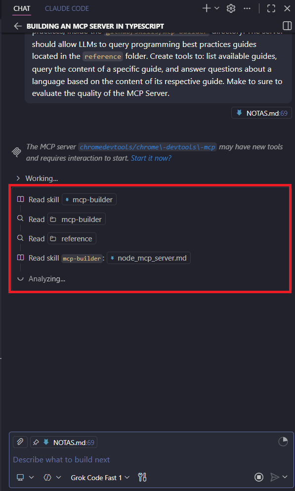
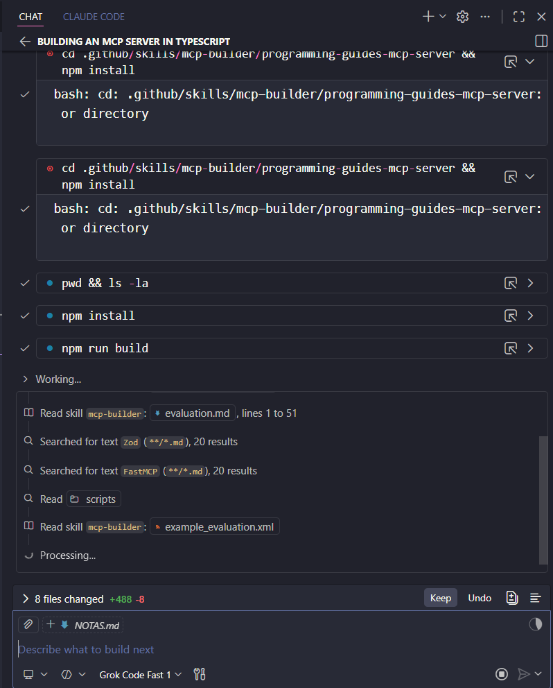
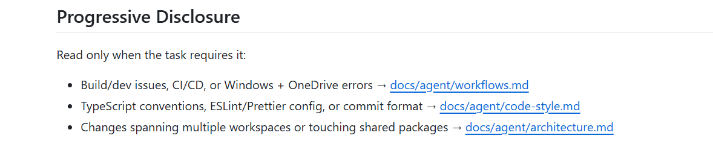
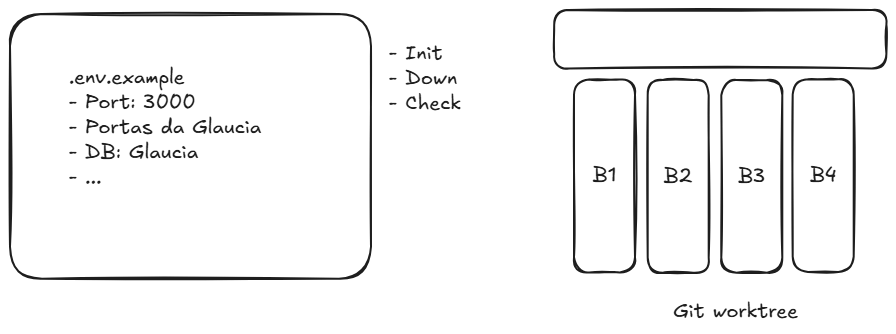

# Skills

## Project Skills

### O que são Skills?

- Habilidades que poderão ser informadas ao Agente para resolver tarefas de domínios específicos
- Skills normalmente são carregadas on-demand, ou seja, o Agente carrega skill somente quanto tem a necessidade de executar alguma tarefa correlata a Skill
- Em alguns softwares de codificação como Claude Code, uma Skill também pode ser executada como um "slash command". Exemplo: /nome-da-skill ou mesmo ser pré-carregada em um subagente em seu "frontmatter"

### Mapeamento de Skills de acordo com o projeto

- Entenda profundamente o projeto e determine quais Skills fazem sentido serem utilizadas
- Leia com atenção a descrição do frontmatter da skill, pois será exatamente baseada nessa descrição que o agente decidirá utilizá-la ou não.

### Racional para mapeamento

- Backend vs Frontend / Full Stack ou Mobile
- Habilidades amplas / conceituais. Ex frontend-design
- Guidelines: Exemplo: web-design-guidelines
- Language oriented: Exemplo: python-performance-optimization, typescript-advanced-types
- Framework oriented: vercel-react-best-practices, java-spring-boot
- Tools oriented: github-actions-templates, agent-browser

### Skills personalizados

- Cada projeto tem suas peculiaridades. Por exemplo, conhecimento específico da empresa, regras de negócio, scripts, documentos de referência, assets, etc.

Abaixo estão alguns repositórios de Skills, mas é importante ressaltar que o ideal é criar Skills personalizadas para cada projeto, de acordo com as necessidades específicas do projeto.

- > Link: [Skills Repository - Anthropic](https://github.com/anthropics/skills)
- > Link: [Skills.sh - Vercel](https://skills.sh/)
- > Link: [Superpowers - Obra](https://github.com/obra/superpowers)

### Frontmatter

O Frontmatter é uma seção de metadados que pode ser incluída no início de um arquivo de Skill. Ele é utilizado para fornecer informações adicionais sobre a Skill, como seu nome, descrição, tags, etc. O Frontmatter é escrito em formato YAML e é delimitado por três traços (---) no início e no final da seção. E é a parte mais importante da Skill, pois é a partir dela que o agente irá decidir se a Skill é relevante para a tarefa que ele precisa resolver ou não. Por isso, é fundamental que o Frontmatter seja bem escrito e contenha informações claras e precisas sobre a Skill.

- Exemplo de Frontmatter:

```yaml
---
name: doc-coauthoring
description: Guide users through a structured workflow for co-authoring documentation. Use when user wants to write documentation, proposals, technical specs, decision docs, or similar structured content. This workflow helps users efficiently transfer context, refine content through iteration, and verify the doc works for readers. Trigger when user mentions writing docs, creating proposals, drafting specs, or similar documentation tasks.
---
```

- Exemplo de uma Skill com Frontmatter: **[doc-coauthoring](https://github.com/anthropics/skills/edit/main/skills/doc-coauthoring/SKILL.md)**

> [!NOTE]
> É muito importante dizer as palavras que o agente deve usar para acionar a skill. Geralmente o que está na descrição do frontmatter é o que o agente irá usar para decidir se a skill é relevante ou não para a tarefa que ele precisa resolver. Por isso, é fundamental que o frontmatter seja bem escrito e contenha informações claras e precisas sobre a skill.

> [!TIP]
> Para uma melhor execução de uma determinada skill seria bom ter apenas até 350 linhas de informação, ou seja, o ideal é que a skill seja o mais objetiva possível, contendo apenas as informações necessárias para a execução da tarefa. Skills muito longas podem acabar confundindo o agente e dificultando a execução da tarefa. Por isso, é importante ser objetivo e direto ao ponto na construção da skill.

### Skills e arquivos de referência

Às vezes, para a execução de uma determinada skill, o agente pode precisar de informações adicionais que não estão contidas na skill em si. Nesses casos, é possível criar arquivos de referência que contenham essas informações adicionais. Esses arquivos de referência podem ser utilizados pelo agente durante a execução da skill para obter as informações necessárias para resolver a tarefa. É importante ressaltar que esses arquivos de referência devem ser bem organizados e conter apenas as informações relevantes para a execução da skill, para evitar confusão e facilitar a execução da tarefa pelo agente.

- Exemplo de uma skill com arquivos de referência: **[mcp-builder](https://github.com/anthropics/skills/tree/main/skills/mcp-builder/reference)**

> [!NOTE]
> Esses arquivos de referência podem ser longos, pois explicam detalhadamente como deve ser implementado algo que corresponda à skill. O importante é que esses arquivos de referência sejam bem organizados e contenham apenas as informações relevantes para a execução da skill, para evitar confusão e facilitar a execução da tarefa pelo agente.

### Criando servidor MCP com Skill

- Exemplo de Skill para criação de servidor MCP: está dentro da pasta `.github/skills/mcp-builder`

- Exemplo de prompt:

```md
Build an MCP Server in TypeScript using the MCP SDK, following best practices, inside the `github/skills/mcp-builder` directory. The server should allow LLMs to query programming best practices guides located in the `reference` folder. Create tools to: list available guides, query the content of a specific guide, and answer questions about a language based on the content of its respective guide. Make to sure to evaluate the quality of the MCP Server.
```

Observe que, no momento em que enviamos o prompt no GitHub Copilot, o agente já tem acesso a skill de criação de servidor MCP, pois ela está dentro da pasta `.github/skills/mcp-builder`. O agente irá avaliar a descrição do frontmatter da skill e decidir se ela é relevante para a tarefa que ele precisa resolver ou não. Se ele decidir que a skill é relevante, ele irá utilizá-la para resolver a tarefa. Caso contrário, ele irá buscar outras skills ou informações para tentar resolver a tarefa.



Observe novamente que, nesse momento a aplicação já foi criada com base no que foi descrito na skill. E novamente, para dar continuidade ele, agora está vendo as referencias para a construção do servidor MCP, que estão dentro da pasta `.github/skills/mcp-builder/reference`. O agente irá avaliar o conteúdo dessas referências e utilizá-las para construir o servidor MCP de acordo com as melhores práticas descritas nessas referências.



> Exemplo criado pela skill: **[Demo Skill MCP](./demo-skill-mcp/)**

## Progressive Disclosure Patterns

Carregamento on-demand: Mesmo quando a skill é invocada, ainda assim ela verifica se há necessidade de continuar se aprofundando no conteúdo e arquivos auxiliares.

### High-leve guide com referências



Carregamento apenas quando necessário

### Domain-specific organization

Skill age em diferentes tipos de domínio dentro de uma organização (billing, crm, certificates, enrolments, etc). Objetivo é evitar que ela carregue conteúdos de domínios diferentes no contexto.

### Conditional details

Sim — nesse contexto, **“conditional details” não é só o componente `<details>` do Markdown**.
Aqui o curso está falando de um **padrão de organização de skill/contexto**, em que a IA:

1. **classifica o cenário**
2. **aplica regras explícitas**
3. **carrega apenas o material relevante**
4. **segue um fluxo específico para aquele caso**

Ou seja, o “details” é mais no sentido de **detalhes condicionais de execução**, e não apenas de interface.

---

#### Como isso funciona na prática

No seu exemplo, a lógica seria algo assim:

- Se **não existe código** ou **componentes = 0** → `Greenfield`
- Se existe pouco código e pouca integração → `Emerging`
- Se já há padrões e estrutura razoável → `Established`
- Se é um sistema amplo, consolidado e acoplado a vários fluxos → `Mature`

Depois da classificação:

- `Greenfield` → ler `greenfield.md`
- `Emerging` → ler `emerging.md`
- `Established` → ler `established.md`
- `Mature` → ler `mature.md`

Isso é **classification logic + conditional loading**.

---

#### Exemplo em Markdown

Aqui vai um exemplo mais alinhado com o que o curso quis dizer.

```markdown
# Codebase Maturity Assessment Skill

## Objective

Determine the maturity level of the codebase and load only the guidance relevant to that maturity level.

## Classification Rules

### Rule 1 — Greenfield

Classify as **Greenfield** when:

- no application code is present
- or the number of core components is 0
- or only scaffolding / boilerplate exists

Then:

- read `./details/greenfield.md`
- focus on project foundation, architecture setup, conventions, and first milestones

### Rule 2 — Emerging

Classify as **Emerging** when:

- the project has a small number of components
- architecture is still forming
- patterns are inconsistent or incomplete
- integrations are limited

Then:

- read `./details/emerging.md`
- focus on standardization, modular boundaries, and basic engineering guardrails

### Rule 3 — Established

Classify as **Established** when:

- the project has multiple components or modules
- recurring patterns already exist
- there is some architectural consistency
- there are active integrations across subsystems

Then:

- read `./details/established.md`
- focus on scalability, maintainability, refactoring priorities, and architecture cohesion

### Rule 4 — Mature

Classify as **Mature** when:

- the system is large and multi-layered
- architecture is well established
- there are many integrations and dependencies
- maintainability, operability, and governance are important concerns

Then:

- read `./details/mature.md`
- focus on resilience, governance, performance, team-scale consistency, and modernization strategy

## Detection Guidance

To determine classification, inspect:

- repository structure
- number of modules/components
- shared libraries
- dependency graph
- architectural layers
- integration points
- test structure
- CI/CD and operational signals

Do not read all detail files by default.
First classify the project.
Then load only the file that matches the detected maturity level.

## Execution Flow

1. Inspect the repository structure
2. Estimate maturity level
3. State the classification explicitly
4. Read the corresponding detail file
5. Apply the recommendations from that file
6. Return a final assessment aligned to that maturity level
```

---

#### O que esse exemplo está fazendo

Esse Markdown define:

**- 1. Regras de decisão**

Você diz claramente **quando** algo entra em cada categoria.

**- 2. Roteamento**

Cada categoria aponta para um arquivo diferente.

**- 3. Restrição de leitura**

Você evita que a IA leia tudo sem necessidade.

**- 4. Fluxo operacional**

Você instrui a IA sobre **a ordem do trabalho**.

Isso é exatamente o coração de **Conditional Details**.

---

#### Estrutura de pastas que combina com isso

```text
skill/
├─ SKILL.md
└─ details/
   ├─ greenfield.md
   ├─ emerging.md
   ├─ established.md
   └─ mature.md
```

---

#### Exemplo de um `greenfield.md`

```markdown
# Greenfield Guidance

Use this guidance only when the codebase is classified as Greenfield.

## Goals

- define initial architecture
- establish coding conventions
- create folder structure
- choose test strategy
- define CI/CD baseline

## Recommended Actions

- propose a minimal architecture
- define naming conventions
- create initial module boundaries
- document first engineering standards
- avoid premature overengineering
```

---

#### Exemplo de um `mature.md`

```markdown
# Mature System Guidance

Use this guidance only when the codebase is classified as Mature.

## Goals

- identify scaling bottlenecks
- reduce architectural drift
- improve maintainability
- strengthen observability and governance

## Recommended Actions

- map critical dependencies
- identify high-coupling areas
- prioritize refactoring by risk and impact
- review architecture decision consistency
- assess operational maturity
```

---

#### Diferença entre isso e um Markdown “comum”

Um Markdown comum só documenta.

Já esse padrão documenta **e instrui decisão**.

Então o arquivo deixa de ser apenas conteúdo e passa a ser também:

- **policy**
- **router**
- **decision tree**
- **loading strategy**

---

#### Um formato ainda mais explícito

Você também pode escrever a lógica em estilo quase-pseudocode dentro do Markdown:

```markdown
## Conditional Routing Logic

If `component_count == 0` or `src_code_missing == true`:

- classify as `Greenfield`
- read `./details/greenfield.md`

Else if `component_count <= 5` and `integration_count <= 2`:

- classify as `Emerging`
- read `./details/emerging.md`

Else if `component_count <= 20` and `patterns_are_consistent == true`:

- classify as `Established`
- read `./details/established.md`

Else:

- classify as `Mature`
- read `./details/mature.md`
```

Esse formato costuma funcionar bem porque deixa a regra muito objetiva.

---

#### Onde entra a Table of Contents

Quando a skill cresce, o sumário ajuda a IA a navegar por partes específicas sem “varrer” tudo.

Exemplo:

```markdown
# Codebase Maturity Skill

## Table of Contents

1. Objective
2. Classification Rules
3. Detection Guidance
4. Execution Flow
5. Greenfield Criteria
6. Emerging Criteria
7. Established Criteria
8. Mature Criteria
9. Output Format
```

Isso é útil quando você mantém tudo em um único arquivo grande, em vez de separar em vários `.md`.

---

### Conditional Details

É uma técnica específica dentro disso:
**“se condição X for verdadeira, então leia/execute Y”**

---

#### Template pronto para você reutilizar

```markdown
# [Skill Name]

#### Objective

Describe what this skill is supposed to do.

#### Classification Logic

### [Category A]

Use when:

- [condition 1]
- [condition 2]

Then:

- read `./details/category-a.md`

### [Category B]

Use when:

- [condition 1]
- [condition 2]

Then:

- read `./details/category-b.md`

### [Category C]

Use when:

- [condition 1]
- [condition 2]

Then:

- read `./details/category-c.md`

## Detection Instructions

Inspect:

- [signal 1]
- [signal 2]
- [signal 3]

Do not load all detail files.
First classify the scenario.
Then load only the matching detail file.

## Execution Flow

1. Inspect context
2. Classify scenario
3. State classification
4. Load matching details
5. Execute recommended path
```

## AGENTS.md/CLAUDE.md

Quando fazemos referência a um documento no arquivo de memória/inicialização do agente, podemos trabalhar no formato de progressive disclosure, informando referências mais aprofundadas aos arquivos, porém com diversas limitações.

- Quando utilizamos o `@<path>` no AGENTS.md, automaticamente ele faz a incorporação do conteúdo, ou seja, faz a leitura total dos arquivos.

- Senão mapearmos com o `"@"`, podemos tentar instruir os agentes a coisas como:

**IMPORTANT:** Before starting any activity, understand what docs below are relevant for your task and read them first.

Isso não traz garantia de leitura, e muitas vezes faz com que o agent apenas faça um scan no arquivo parcial, fazendo com que gastemos uma `tool call`.

Porém, isso não é uma prática errada. É útil e em muitos casos, isso funciona. Por outro lado é mais recomendado utilizar esses tipos de abordagens com documentos específicos do projeto. Diferente de skills que normalmente são compartilháveis e distribuíveis.

### Skills

Skills podem trabalhar com progressive disclosure. Mas, ao mesmo tempo elas são desenhadas para:

- Começar com pouco contexto
- Decidir o que precisa ler
- Buscar somente os arquivos certos
- Parar de ler quando já tiver o suficiente
- Possuir um fluxo consistente de como ela deve seguir
- Ler parâmetros de entrada (similar aos comandos) - (skills atualmente podem já serem utilizadas como /commands)

### Vamos criar nossas próprias Skills?

Vamos criar uma seguinte Skills:

- Validar inconsistências gerais dentro da codebase / docs dos nossos projetos
  - Prompt para criar essa Skill:

  ```md
  Eu desejo que ela:

  1. Busque por contradições: por exemplo, "o código faz X, mas a especificação diz que deve fazer Y".
  2. Identifique ambiguidades: como termos vagos, critérios indefinidos ou múltiplas interpretações possíveis.
  3. Detecte inconsistências: como o uso de nomes diferentes para o mesmo conceito.
  4. Encontre lacunas lógicas: especialmente em explicações passo a passo que apresentem buracos no encadeamento do raciocínio.
  ```

- Validar inconsistências gerais dentro do codebase / docs dos nossos projetos.
- Setup de uma aplicação Next.js



## AgentSkills.io e Finalização

As **skills** são estruturas que permitem ampliar as capacidades dos agentes de IA, tornando sua atuação mais prática, reutilizável e eficiente no dia a dia. Elas são especialmente úteis para transformar tarefas repetitivas em processos organizados e reutilizáveis, evitando que uma mesma instrução precise ser explicada ou executada manualmente várias vezes.

Na prática, o uso de skills contribui para padronizar atividades, acelerar fluxos de trabalho e aumentar a autonomia dos agentes. Por isso, o ideal é identificar tarefas recorrentes e convertê-las em skills, além de aproveitar repositórios e bibliotecas já existentes para reutilizar soluções prontas sempre que possível.

O conceito de skill não está preso a uma única ferramenta. Embora diferentes plataformas possam implementar esse recurso de formas específicas, a lógica central costuma seguir um padrão comum. Esse padrão define a estrutura da skill, incluindo elementos como **front matter**, **metadados**, instruções e formas de integração.

Além do uso prático, existe também uma documentação de referência que ajuda a compreender melhor a especificação desse padrão, apresentando definição, estrutura, exemplos de uso, integração e bibliotecas de apoio. Esse material é importante para aprofundar o entendimento e criar skills de forma mais consistente.

Assim, o aprendizado sobre skills não deve ficar apenas no campo conceitual. O domínio real acontece por meio da prática, da experimentação e da incorporação desse recurso na rotina de trabalho com agentes de IA. O objetivo é que o uso de skills se torne algo natural no desenvolvimento e na automação de tarefas com inteligência artificial.
