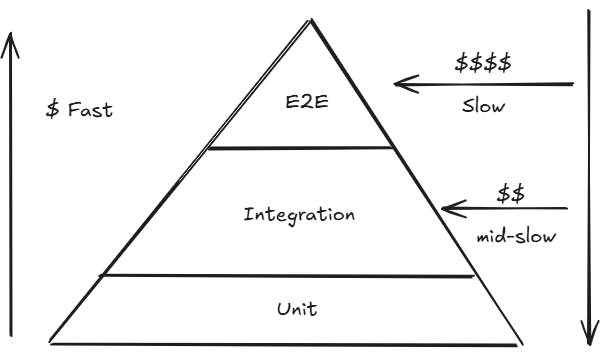
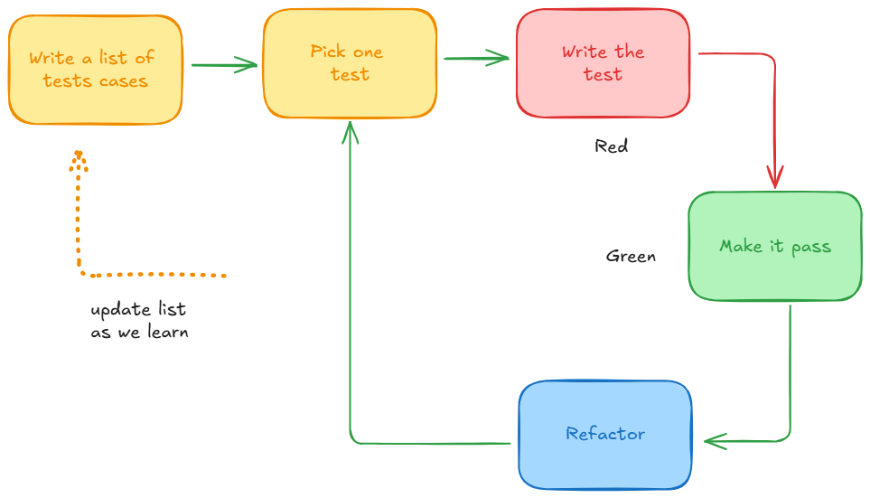

# Testes automatizados no dia zero!

- Testes automatizados utilizando a IA de forma errada pode ser o maior ponto de falsa sensação de segurança que seu código está coberto.
- IA precisa ter clareza do que testar e como testar.
- Testes de UI devem ter um cuidado mais do que especial. Normalmente é aonde grande parte dos tokens são gastos e muitas vezes a IA entra num loop.
- Sempre pense: se eu der uma tarefa, e não intervir, ela será capaz de testar realmente o que foi desenvolvido (independente de quem dessenvolveu?)

## Definição clara sobre o que são testes de Unidade, Integração, E2E

- **Unit Testes:**
  - simples unidades (uma classe, um método, etc. Sem dependências externas)

> [!WARNING]
> Mocks. IA pode tentar gerar muitos mocks para realizar os testes. Tome ainda mais cuidado com FrontEnd

- **Integração:**
  - Pode haver múltiplas interpretações
  - Integração entre classes/componentes do sistema
  - Integração com sistemas externos
  - Incluem banco de dados? Qual tipo? SQLite vs Postgres
  - Integração entre Frontend/backend

- **E2E:**
  - Pode haver múltiplas interpretações
  - Fazer uma chamada completa em uma API?
  - Fazer o teste também chamar serviços externos
  - Abrir o browser executar uma ação que deve chamar a API
  - Verificação de UI

> [!WARNING]
> A falta de definição clara sobre o que cada categoria de teste representa pode gerar situações catastróficas.

## Cobertura de código

Defina claramente os parâmetros sobre o que representa X% de cobertura de c´pdigo.

- A IA tende a garantir literalmente a % de cobertura de código, principalmente os de unidade, em que algumas vezes jamais seriam testados individualmente por conta de relevância e que indiretamente seriam testados por testes de integração.

## Verificação/Implementação

- Busque entender se a abordagem que a IA está utilizando para gerar os testes está correta.

- Faça um planejamento (modo plan), solicitando uma análise de quais são os testes "inúteis" ou redundantes que não deveriam estar no projeto. Após a identificação, se fizer sentido, faça a remoção, e solicite ela adicionar em sua "memória" para não repetir mais esse comportamento, ou tenha uma guideline clara de como o agente deve se comportar.

- Faça um planejamento (modo plan), solicitando uma análise de testes de "edge cases" que ela não implementou. A IA muitas vezes pode tender a fazer testes óbvios, porém, pode evitar realmente pegar exatamente as situações importantes que não seguem o fluxo comum da aplicação.

## Testes desnecessários

Ao trabalhar com geração de testes usando IA, o ponto central não é apenas pedir que a ferramenta crie testes, mas **avaliar criticamente a estratégia que ela está adotando**. Um dos principais problemas é que a IA pode começar a testar comportamentos pouco relevantes, redundantes ou superficiais, enquanto deixa de cobrir fluxos realmente importantes do sistema. Por isso, antes de aceitar a geração automática, é necessário entender **qual padrão de teste está sendo produzido**, quais critérios estão sendo priorizados e se esses testes realmente agregam valor à qualidade do software.

Esse problema se manifesta de forma diferente em projetos **greenfield** e **brownfield**. Em projetos greenfield, como ainda não existe código ou suíte de testes prévia, a IA não possui referências estruturais nem exemplos concretos para seguir. Isso torna a geração de testes mais incerta e exige instruções muito mais específicas e granulares sobre como testar, o que priorizar e qual estilo adotar. Já em projetos brownfield, a presença de testes existentes oferece um padrão observável, permitindo que a IA replique convenções, estrutura e estilo com mais consistência.

Nesse contexto, arquivos como **agents.md**, **claude.md** ou outros artefatos de orientação funcionam como mecanismos temporários de alinhamento. Em fases iniciais, especialmente em greenfield, pode fazer sentido incluir nesses arquivos regras explícitas sobre testes, organização de diretórios e critérios de geração, justamente para compensar a ausência de referência no código. No entanto, esses documentos não devem ser tratados como estáticos. À medida que o projeto amadurece e a base de testes passa a servir como referência viva, parte dessas instruções pode ser removida para reduzir redundância e liberar espaço de contexto para tarefas mais relevantes.

Do ponto de vista técnico, a recomendação é realizar uma **análise deliberada dos testes já existentes** para identificar casos inúteis, redundantes ou de baixo valor. A ideia é pedir que o agente faça um planejamento para localizar testes que não deveriam estar no projeto, removendo-os quando fizer sentido e, em seguida, registrando esse aprendizado em memória ou em guidelines permanentes. Isso é importante porque a IA tende a aprender por repetição de padrão: se a base histórica estiver contaminada por testes fracos, redundantes ou mal direcionados, os próximos testes gerados provavelmente seguirão o mesmo comportamento.

Assim, a discussão sobre testes desnecessários não é apenas uma crítica à geração automática, mas uma orientação sobre **governança de qualidade assistida por IA**. O foco deve estar em ensinar o agente a distinguir o que merece cobertura do que apenas aumenta volume sem aumentar confiança. Em outras palavras, gerar muitos testes não significa gerar bons testes; o valor está em construir uma suíte que reflita riscos reais, comportamentos críticos e padrões consistentes de validação.

### Síntese técnica

A geração de testes com IA precisa ser guiada por contexto, referências e revisão crítica. Sem isso, a tendência é produzir cobertura artificial: muitos testes, pouca utilidade. O uso de instruções temporárias, análise de redundância e memória de padrões inadequados é uma forma de evoluir a qualidade dos testes gerados e evitar que a IA perpetue más práticas.

> [!NOTE]
> exemplo de projeto greenfield que demonstra como criar uma aplicação do zero utilizando IA de forma adequada no processo de desenvolvimento: **[https://github.com/devfullcycle/mba-ia-greenfield-project](https://github.com/devfullcycle/mba-ia-greenfield-project)**

## Criando na prática planejamento para remoção de testes sem valor

Segue um exemplo de prompt para solicitar um planejamento de remoção de testes sem valor: (usando o plan mode)

```md
Quero que você mapeie todos os testes backend e frontend. Avalie quais testes realmente geram valor para a aplicação e cobrem fluxos importantes de negócio, de feature, que garantem realmente problemas de regressão. Baseado nisso, entenda quais são os testes considerados desnecessários, redundantes, inúteis, que não geram valor para a aplicação e que não deveriam existir. Obviamente, se há regras de negócio e componentes que precisam manter a consistência e estado do projeto, esses testes deverão existir. Traga para mim a quantidade aproximada de testes que eu poderia remover e que não geraria um impacto negativo no projeto, principalmente referente a regressões. Evite totalmente testes que já em tese são cobertos pelas próprias bibliotecas, exemplo: zod, pytdantic, entre outros. Traga para mim separado entre backend e frontend.
```

Agora segue uma versão melhorada do prompt (versão: golden prompt):

```md
Você é um(a) Staff QA Engineer especializado(a) em estratégia de testes, risco de regressão e qualidade de suíte em projetos backend e frontend.

Objetivo:
Mapear todos os testes existentes, separar o que gera valor real para o produto e identificar testes redundantes/inúteis que podem ser removidos com baixo risco de regressão.

Escopo:

- Backend e frontend.
- Testes unitários, integração e E2E.
- Código de teste + fluxos de negócio/feature cobertos.
- Não criar nem remover testes; apenas analisar e propor plano de otimização.

Regras obrigatórias:

1. Baseie-se apenas em evidências do repositório (arquivos de teste, código, fixtures, utilitários e cobertura observável).
2. Classifique valor de cada teste por risco real mitigado, não por quantidade de asserts.
3. Não marque para remoção testes que protegem regra de negócio, consistência de estado, contratos críticos ou fluxos de receita/segurança.
4. Marque como “suspeita de redundância” quando múltiplos testes cobrem o mesmo comportamento sem ganho incremental.
5. Evite testes de comportamento já garantido por bibliotecas/frameworks (ex.: validações internas de zod/pydantic), exceto quando houver regra customizada de negócio por cima.
6. Sempre separar análise entre backend e frontend.
7. Quando faltar contexto, explicite suposição e impacto da incerteza.
8. Entregue uma estimativa de quantos testes podem ser removidos com baixo risco, por camada.

Critérios para classificar “teste de valor”:

- Cobre fluxo crítico de negócio.
- Detecta regressão relevante para usuário/receita/segurança.
- Valida integração real entre componentes ou contratos.
- Protege comportamento customizado (não apenas default de biblioteca).
- Reduz risco em cenários de erro, borda ou estado inconsistente.

Critérios para classificar “teste removível”:

- Redundante com outro teste mais abrangente.
- Cobre detalhe de implementação sem valor de negócio.
- Revalida comportamento nativo de biblioteca/framework.
- Frágil/instável sem sinalizar risco real.
- Custo de manutenção alto com benefício baixo.

Formato de saída obrigatório (somente tabelas + resumo final):

## Tabela 1 - Inventário de cobertura atual

| ID  | Camada (Backend/Frontend) | Tipo (Unit/Integration/E2E) | Arquivo/Cenário | Fluxo/Feature coberto | Risco mitigado | Valor (Alto/Médio/Baixo) |
| --- | ------------------------- | --------------------------- | --------------- | --------------------- | -------------- | ------------------------ |

## Tabela 2 - Testes de alto valor que devem permanecer

| ID  | Camada | Teste/Cenário | Motivo de valor | Regressão evitada | Criticidade (Alta/Média/Baixa) |
| --- | ------ | ------------- | --------------- | ----------------- | ------------------------------ |

## Tabela 3 - Candidatos à remoção ou consolidação

| ID  | Camada | Teste/Cenário | Motivo (redundante/inútil/baixo valor) | Cobertura equivalente existente | Risco de remover (Baixo/Médio/Alto) | Recomendação (Remover/Consolidar/Manter) |
| --- | ------ | ------------- | -------------------------------------- | ------------------------------- | ----------------------------------- | ---------------------------------------- |

## Tabela 4 - Quantitativo estimado de remoção segura

| Camada | Total atual (estimado) | Candidatos à remoção (baixo risco) | Candidatos à consolidação | % otimização estimada | Nível de confiança (Alto/Médio/Baixo) |
| ------ | ---------------------- | ---------------------------------- | ------------------------- | --------------------- | ------------------------------------- |

## Tabela 5 - Exclusões por “cobertura de biblioteca”

| Camada | Biblioteca/Framework | Tipo de teste redundante identificado | Exemplo de padrão encontrado | Ação recomendada |
| ------ | -------------------- | ------------------------------------- | ---------------------------- | ---------------- |

## Resumo executivo (máximo 10 linhas)

- Principais ganhos ao remover/consolidar testes.
- Principais riscos a evitar durante a limpeza.
- Ordem sugerida de execução (backend vs frontend).
- Estimativa final total de testes removíveis sem impacto negativo relevante em regressão.
```

## Report dos testes que poderiam ser removidos



O conteúdo discute como a análise automatizada de testes pode ajudar a revisar a qualidade da suíte de testes de um projeto e identificar quais casos realmente agregam valor à aplicação. A proposta não é simplesmente remover testes para diminuir volume, mas entender se a estratégia atual está equilibrada ou se existe excesso de validações redundantes, repetitivas ou pouco úteis.

A análise mostra que, em muitos projetos, principalmente aqueles que já cresceram bastante, é comum existir uma quantidade elevada de testes no front-end e no back-end que validam comportamentos já assegurados por bibliotecas externas ou frameworks maduros. Isso significa que parte da suíte pode estar testando algo que já é garantido por ferramentas consolidadas, em vez de concentrar esforço nos comportamentos específicos do negócio e nos riscos reais do sistema. Nesse cenário, a existência de muitos testes não representa necessariamente uma estratégia de qualidade melhor. Em alguns casos, pode significar apenas mais custo de manutenção, mais tempo de execução e mais complexidade para evoluir o código.

Para interpretar melhor esse problema, o conteúdo retoma a lógica da pirâmide de testes. Na base estão os testes de unidade, que são mais rápidos, mais baratos e mais precisos para localizar falhas em regras de negócio isoladas. No nível intermediário estão os testes de integração, que verificam a interação entre componentes e validam cenários mais próximos do comportamento real do sistema. No topo estão os testes end-to-end, que exercitam o fluxo completo da aplicação e, por isso, tendem a ser mais lentos, mais caros e mais sensíveis a dependências externas. A ideia principal é que a distribuição dos testes deve respeitar esse equilíbrio: quanto mais próximo do topo, maior o custo; quanto mais próximo da base, maior a velocidade e menor o custo de execução.

A partir dessa visão, fica claro que nem todo teste precisa ser mantido apenas porque existe. Se determinada validação já está suficientemente coberta por um teste de integração, ou se ela apenas reafirma o comportamento esperado de uma biblioteca confiável, pode não haver justificativa técnica forte para manter também testes unitários redundantes sobre aquele mesmo aspecto. A discussão, portanto, não é contra testes, mas contra o acúmulo de testes que pouco contribuem para aumentar a confiança no sistema. O foco deve estar em manter testes que protegem comportamentos críticos, ajudam a detectar regressões relevantes e refletem riscos concretos da aplicação.

Outro ponto importante é que a decisão sobre remover ou manter testes não deve ser feita de forma automática. A automação e a IA funcionam como apoio analítico, mostrando padrões de redundância e sugerindo otimizações, mas a decisão final continua dependendo de julgamento técnico. O desenvolvedor ou arquiteto precisa avaliar o contexto do projeto, a criticidade das funcionalidades, a confiabilidade das bibliotecas utilizadas e os efeitos que uma eventual remoção pode causar na segurança da evolução do software.

A conclusão principal é que a estratégia de testes precisa ser revisada periodicamente. Uma suíte saudável não é a que acumula o maior número de casos, mas a que consegue equilibrar custo, cobertura útil, velocidade de execução e proteção real contra falhas. Nesse sentido, utilizar ferramentas automatizadas para identificar excessos e redundâncias é uma prática importante para manter a base de código mais sustentável, reduzir o peso da esteira de integração contínua e garantir que os testes estejam realmente alinhados com os objetivos de qualidade do sistema.

### Síntese

A principal ideia é que **qualidade de testes não deve ser medida apenas por quantidade ou cobertura**, mas pelo valor que cada teste entrega. Uma boa estratégia é aquela que evita redundâncias, respeita a pirâmide de testes e concentra esforço na validação do que realmente importa para a estabilidade e a evolução do software.

## Gerando report the 'Edge Cases' que não foram testados

Use o seguinte prompt para gerar um relatório dos 'edge cases' que não foram testados: (usando o plan mode)

```md
Avalie todos os testes do sistema, incluindo frontend e backend. Identifique os testes automatizados e os principais aspectos que esses testes estão cobrindo. Porém, baseado nesse mapeamento, verifique testes de edge cases, ou seja, testes que tragam um possível caminho triste, que não estão cobertos pelos testes atuais, como error handling, rate limiting, segurança, fluxos principais que podem ter excessões não tratadas, entre outros. Explore o código, entenda os seus principais fluxos, comportamentos e possíveis problemas que podem acontecer e que não estão previstos no código, validações ou mesmo em nível de feature. Categorize esses tipos de teste, incluindo os de backend e frontend e traga exatamente o que não está coberto e o motivo pelo qual deveríamos implementar. No final, faça um resumo e traga a quantidade esperada de novos testes que deverão ser criados apenas nesses tipos de situação.
```

Outro prompt melhorado (versão: golden prompt):

```md
Você é um(a) QA Engineer Sênior com foco em risco, resiliência e prevenção de regressão.

Objetivo:
Mapear a cobertura atual de testes (frontend e backend) e identificar edge cases críticos não cobertos, com priorização prática para implementação.

Regras de execução:

1. Analise somente com base no código e testes existentes.
2. Se não houver evidência clara de cobertura, classifique como: Não coberto.
3. Não traga recomendações genéricas; toda lacuna deve estar vinculada a um fluxo/feature real.
4. Evite redundância; não proponha teste que já esteja coberto de forma suficiente.
5. Priorize risco de produção e impacto no negócio.

Escopo obrigatório de edge cases:

1. Error handling e exceções não tratadas.
2. Timeouts, indisponibilidade de dependências, retry, fallback.
3. Rate limiting, throttling e abuso de API.
4. Segurança: autenticação, autorização, validação de entrada, injeções, exposição de dados sensíveis, CORS/CSRF/XSS quando aplicável.
5. Concorrência: idempotência, race conditions, duplicidade de eventos/requisições.
6. Integridade e consistência de dados/transações.
7. Casos de borda de domínio: limites, nulos, formatos inválidos, estados inesperados.
8. Fluxos críticos em caminho triste.

Formato de saída obrigatório:
Retorne somente tabelas Markdown, nesta ordem.

Tabela 1: Cobertura Atual
| ID | Camada (Frontend/Backend) | Tipo (Unit/Integration/E2E) | Fluxo/Feature | O que está coberto | Evidência (arquivo de teste/cenário) | Nível de confiança (Alto/Médio/Baixo) |
|---|---|---|---|---|---|---|

Tabela 2: Gaps de Edge Cases Não Cobertos
| ID | Camada | Fluxo/Feature | Edge case não coberto | Tipo de teste recomendado | Severidade (Alta/Média/Baixa) | Impacto em produção | Probabilidade | Motivo para implementar | Critério de aceite |
|---|---|---|---|---|---|---|---|---|---|

Tabela 3: Priorização de Implementação (Top 10)
| Prioridade | ID do gap | Teste sugerido | Risco reduzido | Esforço (Baixo/Médio/Alto) | Justificativa objetiva |
|---|---|---|---|---|---|

Tabela 4: Estimativa de Novos Testes
| Dimensão | Categoria | Quantidade estimada |
|---|---|---|
| Camada | Frontend | |
| Camada | Backend | |
| Tipo | Unit | |
| Tipo | Integration | |
| Tipo | E2E | |
| Risco | Segurança | |
| Risco | Resiliência | |
| Risco | Validação | |
| Risco | Concorrência | |
| Total | Geral | |

Tabela 5: Resumo Executivo
| Item | Resultado |
|---|---|
| Pontos bem cobertos | |
| Principais riscos não mitigados | |
| Ganho esperado com novos testes | |
| Nível de confiança da análise | |

Critérios de qualidade da resposta:

1. Específica ao sistema analisado.
2. Acionável e priorizada.
3. Objetiva, sem teoria desnecessária.
4. Clara sobre suposições e incertezas.
```

# Test Guide Skill

- Crie ou utilize uma skill adequada para ser usada como guideline para criação/manuntenção dos testes, bem como para auditar os testes atuais.

> [!NOTE]
> Exemplo de skill de Test Guide: **[https://github.com/devfullcycle/skills-mba/blob/main/test-guide/SKILL.md](https://github.com/devfullcycle/skills-mba/blob/main/test-guide/SKILL.md)**

## Testes de Frontend/Browser

- Quando estiver trabalhando com frontend, tenha clareza exata do que ela deve testar, indicando exatamente quais os fluxos.

- A IA tende a iniciar sempre um fluxo do zero. Logo, 70% dos testes, provavelmente serão executados de forma redundante. Aproveite sessões/cookies do browser.

- Trabalhe ao máximo de forma headless.

- Entenda o nível de complexidade dos testes. Grande parte dos testes podem ser feitos com `playwiright-cli` + Skills (mais leve). Ao invés de Playwright + MCP. Sendo o Playwright um exemplo de ferramenta de testes.

> [!NOTE]
> Instalação do Playwright CLI: `npm install -D @playwright/cli` ou Link para documentação: **[https://playwright.dev/docs/cli](https://github.com/microsoft/playwright-cli)**
> Skill do Playwright CLI: **[https://skills.sh/microsoft/playwright-cli/playwright-cli](https://skills.sh/microsoft/playwright-cli/playwright-cli)**

> [!NOTE]
> A Skill criada pela Full Cycle MBA, chamada `E2E Nav Test`, auxilia na análise de uma codebase de aplicação web (SPA, server-rendered ou híbrida), gera um plano de teste estruturado com consciência de dependências e, opcionalmente, executa os testes usando automação de navegador. Link da Skill: **[https://github.com/devfullcycle/skills-mba/blob/main/e2e-nav-test/SKILL.md](https://github.com/devfullcycle/skills-mba/blob/main/e2e-nav-test/SKILL.md)**

## TDD (Test Driven Development) com IA

- TDD sempre foi uma ótima metodologia para o desenvolvimento de software e sem dúvidas pode ser uma abordagem extremamente válida para o processo de desenvolvimento com IA

- TDD visa criar primeiramente os testes para depois a implementação e refatoração.


