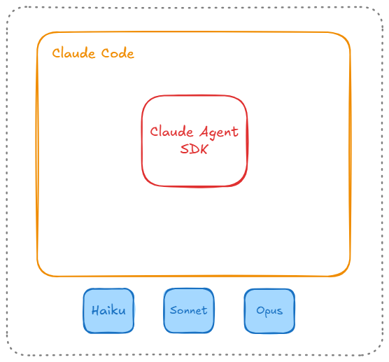

# Claude Code

## Anthropic

- Fundada em janeiro de 2021 em São Francisco, Califórnia.
- Criada por sete ex-funcionários da OpenAI, incluindo os irmãos Dario e Daniela Amodei, que ocuparam cargos de liderança na OpenAI.
- Dario era Vice Presidente de Pesquisa da OpenAI e trabalhou no desenvolvimento do GPT-2 e GPT-3
- Daniela era VP de Safety & Policy na OpenAI
- A saída da OpenAI foi motivada por diferenças de visão sobre segurança de IA

### Evolução e Investimentos

- Maio 2021: Primeira rodada de investimentos de $124 milhões
- Abril 2022: Rodada de $580 milhões, incluindo $500 milhões
- Dezembro 2022: Lançamento da técnica de "Constitutional AI" - treinamento de modelos com princípios éticos definidos por humanos
- 2022: Treinamento e lançamento inicial do Claude, o chatbot/assistant de IA da empresa
- Setembro 2023: Amazon anuncia investimento de até $4 bilhões na Anthropic, com foco em desenvolvimento de IA generativa e integração com AWS
- Outubro 2023: Google investe $500 milhões (com compromisso de mais $1.5 bilhões)
- Março 2025: Rodada Série E de $3.5 bilhões, avaliando a empresa em $61.5 bilhões
- Novembro 2025: Avaliação estimada em $350 bilhões

## Claude Code

- Claude Code é uma ferramenta de coding agêntica (PRODUTO)
- Autosuficiente:
  - Autonomia para ser executado de forma independente (interface CLI, chamadas diretas via bash e similares)
  - Extensões em IDEs (VSCode, Cursor, JetBrains, etc)
- Utiliza os modelos da Anthropic (Haiku, Sonnet e Opus)

### Como tudo começou e "filosofia"

- Um projeto paralelo do Boris Cherny (@bcherny). Engenheiro da Anthropic
- Objetivo era ser um projeto de pesquisa para uso interno na Anthropic.
- Lançado publicamente em 2025
- Criado intencionalmente 'low level', dando acesso quase direto ao modelo sem forçar workflows específicos
- A Anthropic sempre usa o termo "harness": Modelo de IA é o cavalo, o Claude Code é o que o controla.

### Claude Agent SDK

- O Claude Agent SDK é a infraestrutura que alimenta o Claude Code
- É uma biblioteca disponível em TypeScript e Python que permite construir seus próprios agentes de IA
- Um desenvolvedor por criar "seu próprio Claude Code" usando o SDK

#### Principais capacidades:

#### Claude Code + Claude Agent SDK

#### Formatos de execução

- Terminal (CLI)
- Claude Code on the Web (claude.ai/code)
- Aplicação Desktop
- Extensões (VS Code, JetBrains, etc)
- GitHub Actions/ GitLab CI/CD
- Slack
- Chrome
