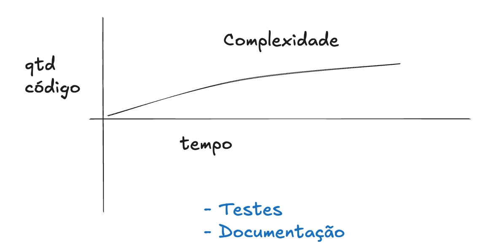
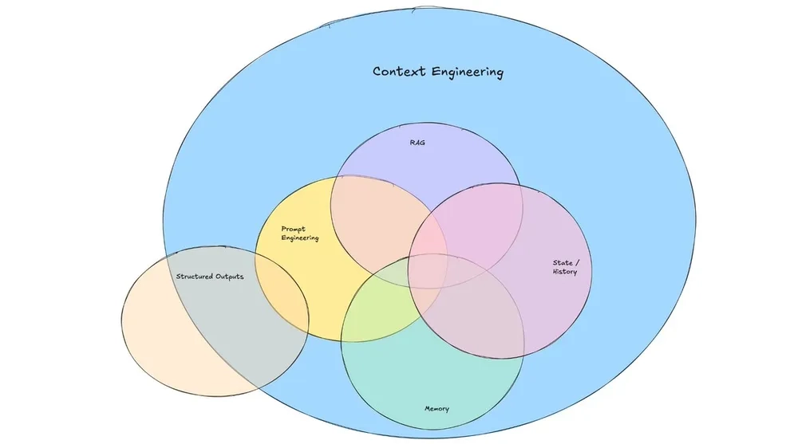

# Quick Wins com IA - 29/07/2025

## Excalidraw

[Link para o Excalidraw](https://link.excalidraw.com/readonly/o0p0jhaHnLDKZV1bdgv8)

# Principais tópicos abordados

## Ferramentas de desenvolvimento com IA

- Baseadas em IDEs:
    - [Cursor](https://cursor.com/)
    - [Windsurf](https://windsurf.com/)
    - [VSCode + Github Copilot](https://code.visualstudio.com/ + https://github.com/features/copilot)
    - [JetBrains](https://www.jetbrains.com/)
- Agentes CLI
    - [Claude Code](https://www.anthropic.com/index/claude)
    - [Gemini](https://www.deepmind.com/gemini)
    - [Codex](https://openai.com/blog/openai-codex)

---

## Documentos de Contexto

Documentos adicionados ao projeto de software tornam-se um ativo a longo prazo, ajudando a minimizar o aumento da complexidade do software com o tempo. Assim como os testes automatizados são ativos valiosos para o software, os documentos de contexto também se enquadram nessa categoria.

### Rules / Memories

São documentos normalmente utilizados pelas IDEs e Agentes de IA para que o agente consiga aplicar regras e lembrar de comportamentos sobre como o software deve ser desenvolvido. Ferramentas como Cursor oferecem a possibilidade de criar diversos arquivos de rules, que ficam armazenados na pasta .cursor/rules. Já agentes CLI como Claude Code utilizam um arquivo específico para isso, ex: CLAUDE.md.

A diferença semântica entre Rules e Memories pode depender diretamente da IDE ou Agente. Por exemplo: O Cursor possui arquivos específicos de regras que a IA deve seguir, mas também conta com recursos de memories que são acessados pelo modelo, trazendo lembretes sobre como o agente deve se comportar. Ex: "Todas as vezes que criar uma função pública, deve-se fazer sua documentação como comentário logo acima da função."

Já ferramentas como CLAUDE Code, tratam o conceito de memories como instruções que são lidas diretamente do arquivo CLAUDE.md.



## Context Engineering

### O que é?

Construção de sistemas e workflows que fornecem as informações e ferramentas corretas no formato ideal para a LLM.

### O problema não está "somente" no LLM

A maioria das falhas em sistemas baseados em LLM não ocorre porque o modelo é ruim, mas porque o contexto, as instruções ou as ferramentas não foram fornecidos adequadamente.

### Context Engineering vs Prompt Engineering

- Prompt Engineering concentra-se na criação de instruções textuais estáticas.
- Context Engineering abrange isso e vai além, organizando contextos dinâmicos, integrando múltiplas fontes e formatando-as apropriadamente para o modelo



https://blog.langchain.com/the-rise-of-context-engineering/

## Tipos de documentos essenciais para ampliação de contexto:

- Contexto Geral (Descreve do que o projeto se trata)
    - Produto (Informações sobre o produto/feature a ser desenvolvido)
    - Técnica (Visão geral de tecnologias, metodologias e guidelines que serão utilizados)
- Stack
    - Libs/frameworks (terceiros)
        - Acesso à documentação oficial da biblioteca
        - Utilização do Context 7 como repositório de documentação
        - Clonagem do repositório do projeto para gerar documentação baseada no código fonte
        - Utilização do Firecrawl para webscraping mais profundo de páginas de documentação
- Guidelines (Regras recomendadas para que a IA siga determinados padrões como formatação, documentação, desenvolvimento, testes, entre outros)
- README
    - Informações para execução do projeto
    - Índice com o caminho para toda a documentação do projeto
- ADRs (Architecture Decision Records)
    - Documento que especifica por que determinada arquitetura, componente ou ferramenta foi escolhida. Isso reduz o risco da IA utilizar ferramentas/bibliotecas além do escopo definido na ADR.
- Plano de ação (Visão de alto nível do que será desenvolvido no projeto)
    - Vídeo explicativo com mais detalhes sobre plano de ação: https://www.youtube.com/watch?v=9QONsyOEqa8
- Tarefa
    - Itens detalhados passo a passo do que será desenvolvido, normalmente acompanhados de uma TODO list. Mesmo que ferramentas como Claude Code tenham sua própria todo list, o desenvolvedor terá seu próprio documento de gerenciamento de tarefas.
- State.local.md
    - Define o estado atual do projeto, informando em que momento ele está, quais features foram implementadas e onde o processo de desenvolvimento parou. O objetivo principal é que a IA entenda o estado atual do desenvolvimento.

> Nota mental: Lembre-se que cada vez que um novo chat é iniciado é como se um novo desenvolvedor tivesse sido contratado na empresa. Portanto, reflita sobre o que esse "desenvolvedor" precisa ter em mãos para entregar determinada tarefa com eficiência.
> 

---

## Assistentes para criação de documentos de Contexto e ADRs

- ADR Generator - https://chatgpt.com/g/g-67b8030765cc81919232eb75ba5312d6-promptgo
- Context Generator - https://chatgpt.com/g/g-67fd6d81ec6c8191a3a04adfc22d6fc5-context-generator

---

## Janelas de Contexto

Todo modelo de IA possui uma **janela de contexto**, que representa a quantidade máxima de **tokens** que ele consegue processar em uma única interação (ou ao longo de uma sequência de mensagens) sem perder o “fio da meada”. Tokens são pedaços de texto que podem corresponder a uma palavra, parte de uma palavra ou até mesmo a pontuações. Por exemplo, a palavra “desenvolvimento” pode ser quebrada em dois ou três tokens, dependendo do modelo.

Quanto maior a interação com a IA, mais tokens são utilizados. Ao ultrapassar esse limite da janela de contexto, o modelo precisa **esquecer partes do início da conversa**, o que afeta diretamente a sua capacidade de manter coerência e aumenta significativamente o risco de **alucinações** (respostas erradas ou inventadas).

Esse processo funciona como uma **sliding window** (janela deslizante), onde os tokens mais recentes "empurram" os mais antigos para fora da memória ativa do modelo. Isso é especialmente importante quando estamos desenvolvendo em modo **agêntico**, ou seja, com agentes de IA que tomam decisões com base em múltiplas interações. Nesse caso, cada nova etapa consome tokens, e o histórico vai sendo gradualmente descartado se não houver controle.

Por isso, recomendamos fortemente **criar um chat para cada tarefa ou subtarefa**. Isso ajuda a manter o foco e evita que o modelo carregue informações desnecessárias, reduzindo o risco de inconsistência e melhorando a qualidade das respostas.

Quando utilizamos **documentos de contexto** durante o desenvolvimento, esses arquivos também consomem tokens ao serem lidos pela IA. Isso reduz a janela disponível para outras instruções ou histórico da conversa. Trata-se de um claro **trade-off**: quanto mais contexto textual oferecemos, mais tokens consumimos, mas em troca o modelo tende a gerar **respostas mais precisas e alinhadas com os documentos**. No entanto, isso pode (e deve) ser otimizado com bons prompts: é possível instruir a IA a **consultar apenas os documentos relevantes** para a tarefa atual, mantendo a eficiência do uso da janela de contexto.

Por fim, vale lembrar que alguns modelos, como **Gemini 2.5 Pro e GPT 4.1**, possuem **janelas de contexto muito amplas**, chegando a 1 milhão de tokens. Isso representa uma vantagem significativa para projetos complexos, pois permite o carregamento de grandes volumes de documentos e histórico sem perda de informações relevantes.

---

## Context 7 e MCP Server

O Context 7 é um site que reúne uma extensa coleção de documentações oficiais de bibliotecas, linguagens de programação e frameworks. Ele disponibiliza um servidor MCP que permite à IA ter acesso mais direto a essas documentações.

Uma estratégia eficaz para utilizar o Context7 é baixar a documentação relevante ao escopo do projeto através da IA via servidor MCP. Dessa forma, a IA terá acesso mais contextualizado às documentações necessárias de bibliotecas de terceiros.

### Exemplo de utilização do Context 7 junto ao Claude Code:

Passo 1: Adicionar o servidor MCP: 

```bash
claude mcp add --transport http context7 https://mcp.context7.com/mcp
```

Passo 2: Entrar na pasta do projeto e iniciar o Claude:

```bash
cd ~/Project
claude
```

Passo 3: Prompt simplificado para geração das documentações

```bash
Analise o codebase do projeto, focando na pasta src e no arquivo requirements.txt e identifique todas as bibliotecas de terceiros usadas. Use o Context7 MCP Server para buscar a documentação relevante de cada uma biblioteca. Crie arquivos markdown (*.md) na pasta /docs/libs com tais documentações (por exemplo: LANGCHAIN.md, PINECONE.md). GARANTA que você utilizará o Context7 MCP.
```

---

## Workflow de desenvolvimento baseado em PRPs (Product Requirement Prompts)

> A PRP é um PRD + inteligência de base de código curada + agente/runbook — o pacote mínimo viável que uma IA precisa para gerar código pronto para produção já na primeira tentativa.
> 

> O *Product Requirement Prompt* (PRP) é uma metodologia estruturada de prompt criada no verão de 2024, com foco principal em *context engineering*. Um PRP fornece a um agente de codificação por IA tudo o que ele precisa para entregar um recorte vertical de software funcional — nada mais, nada menos.
> 

Essa iniciativa foi feita através do projeto: https://github.com/Wirasm/PRPs-agentic-eng. 

Observação: No README desse repositório há o detalhamento passo a passo de como colocar tudo em prática.

[Exemplo de um PRP gerado durante a aula](https://devfullcycle.notion.site/Exemplo-de-um-PRP-gerado-durante-a-aula-2411423c038880fe80fcf539e9a94f4b)

---

## Referências:

- https://github.com/Wirasm/PRPs-agentic-eng
- https://context7.com/
- https://www.firecrawl.dev/
- https://blog.langchain.com/the-rise-of-context-engineering/
- https://www.anthropic.com/news/model-context-protocol
- https://link.excalidraw.com/readonly/o0p0jhaHnLDKZV1bdgv8