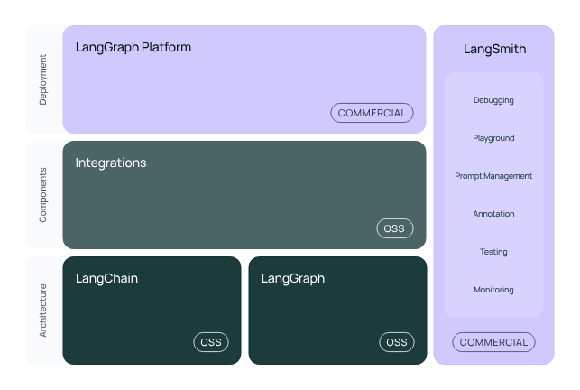

# Introdução a LangChain

## Introdução ao LangChain

### Criação

- Outubro de 2022
- Criado por Harrison Chase
- Abril de 2023
  - Formalizou a startup
  - Investimento inicial levantado: ~= US$ 35 milhões
  - Investimento (Series B): 100mi. Valor estimado da empresa 1.1 bi
  - Fevereiro de 2024: Lançamento do LangSmith
  - Maio de 2025: LangGraph Platform

## Histórico e ecossistema

### LangSmith

    * Observabilidade, debbugging
    * Monitoramento em produção
    * Avaliação de performance de modelos
    * Custos e latência

### LangServe Hosted

    * Plataforma para deploy de aplicações LangChain
    * Infra gerenciada
    * Escalabilidade automática

### LangGraph Platform

    * Infraestrutura para agentes de IA
    * Agentes de longa duração
    * Gerenciamento de workflows completos

### LangGraph Studio

    * Interface para gerenciamento de projeto LangGraph

### LangChain Hub

    * Catálogo para publicar, versionar, testar e baixar prompts e outros artefatos
    * Faz parte do LangSmith, com playground e SDK para pull/push

## Principais Recursos

### Sobre

- Simplifica a integração com LLMs e serviços auxiliares

  - Ex.: carregamento de dados, memória, busca por documentos, agentes, roteadores.

- Fornece um conjunto de abstrações que facilitam a construção de "chains" (Fluxo de execução de chamadas e transformações)

- Evoluiu MUITO rápido entre 2023 e 2024.

- Foi separada em pacotes específicos ao longo do tempo:
  - langchain-core, langchain (implementação de referência)
  - langchain-community (integrações extras)
  - pacotes de terceiros

### Principais recursos

- Criação de chains: fluxos de execução compostos por etapas (runnables)

  - cada etapa pode chamar modelos, processar dados, etc.

- LangChain Expression Language (LCEL): realiza essas operações utilizando "pipe" ("|") para compor etapas.

- Carregamento e divisão de documentos: consegue carregar CSVs, JSON, HTML, Markdown, Sites...

- Modelos de Embedding e Armazenamento Vetorial: interface para gerar embeddings com OpenAI, HuggingFace, etc e armazenar vetores em bancos como Pinecone, PGVector(postgres), Weaviatem, FAISS...

- Busca por similiidade em bancos de dados vetoriais

- Agentes e ferramentas: agentes usam a LLM para processar a entrada e conseguem decidir quais ações/ferramentas executar.

- memórica e histórico

- prompt Templates e placeholders

- outputParsing e Pydantic

- Sumarização, utilizando map-reduce

## Entendendo arquitetura básica

## Gerenciamento de Memória

- LLMs são stateless -> não guardam informação
- "Conversa" -> não são armazenadas no modelo
- Enviar novamente 100% do histórico de mensagens
- LLM -> Memória interna (Componentes de baixo nível)
- Histórico: Curto prazo vs longo prazo
  - Curto Prazo: memória que é utilizada durante uma transação/conversa/processamento
    - armazenar temporariamente
    - armazenar em banco de dados
  - Longo Prazo: histórico da "conversa"
    - armazenar em banco de dados
    - possibilidade de restaurar o conteúdo anterior para continuar de onde parou
    - ler esse histórico para ter contexto par continuar a "conversa"
    - sumarização
